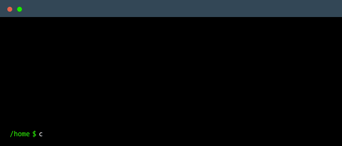

 

    

---

### Main skills

### Studying

---

###  Connect With Me

  

  

  

  <a href="https://linkedin.com/in/navid_asefi">LinkedIn</a> •
  <a href="https://t.me/internalorgansofawhale">Telegram</a> •
  <a href="mailto:navidasefi5@gmail.com">Email</a>

### Employer?
> [!IMPORTANT]  
> <a href="https://drive.google.com/file/d/1tchbJ_3RCE4wETe9gtuYltu4eERvR2Ht/view?usp=drive_link" download>Download my resume</a>

